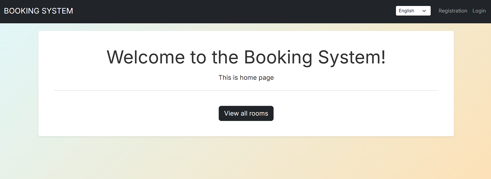

<h1>Booking</h1>

### Introduction
The goal of this project is simple **Django** web site, about **Hotel Booking Aggregator**

In this Project you can:
* Add some rooms, using **Django Admin Panel**.
* Authenticate or Login **your profile** 
* Add a lot of details to your room
* Order room and add your order in DataBase
* See details of your order

## How to install the project:
EN:
1. Download project to your devace, using zip-file or link for project. / (if you use link) git clone https://github.com/dubinkavovchik406-bot/Booking.git
3. Open this folder using your IDE
4. Make for you, virtual environment: python -m venv venv
5. Activate it: (on Windows) venv\Scripts\activate / (on Linux or macOS) source venv/bin/activate
6. Download dependence in your virtual environment: pip install -r requirements.txt
7. Run on your LocalHost: python manage.py runserver

RU:
1. Загрузите проект на ваше устройство, используя ZIP-архив или ссылку на проект / (в случае с ссылкой) git clone https://github.com/dubinkavovchik406-bot/Booking.git
3. Откройте эту папку в вашей интегрированной среде разработки (IDE).
4. Создайте для себя виртуальное окружение: python -m venv venv
5. Активируйте его: (Для Windows) .\venv\Scripts\activate / (Для Linux или macOS) source venv/bin/activate
6. Установите зависимости в вашем виртуальном окружении: pip install -r requirements.txt
7. Запустите на вашем LocalHost: python manage.py runserver

